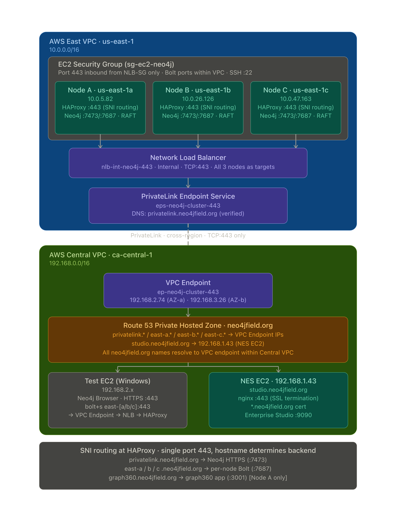

# Secure Neo4j Access Over Port 443 — PrivateLink, HAProxy, and NLB

This repository provides a production-tested, step-by-step guide for exposing a **3-node Neo4j 5.x Enterprise cluster** across AWS VPCs using **AWS PrivateLink**, all traffic over **port 443 only**.

Two approaches are documented:

| | Approach 1: HAProxy + NLB + PrivateLink | Approach 2: NES (No HAProxy) + PrivateLink|
|---|---|---|
| Access | HTTPS (Browser) + Bolt | Bolt only (via NES) |
| HAProxy | Required on each cluster node | Not needed |
| Client tooling | Any browser or driver | Neo4j Enterprise Studio (EAP) |
| Port | 443 for all traffic | 443 for Bolt only |

---

## Architecture Diagram



---

## Architecture at a Glance

```
Consumer VPC (client)
  └── App / NES / Browser
       └── DNS: privatelink.example.com → Interface Endpoint ENI
            └── AWS PrivateLink
                 └── Network Load Balancer (port 443)
                      └── HAProxy (Approach 1) or direct Neo4j Bolt (Approach 2)
                           └── Neo4j Cluster (3 nodes, 3 AZs)
```

```
Provider VPC (us-east-1)
  ├── Neo4j Node A (us-east-1a) — HAProxy + Neo4j
  ├── Neo4j Node B (us-east-1b) — HAProxy + Neo4j
  └── Neo4j Node C (us-east-1c) — HAProxy + Neo4j
```

---

## Table of Contents

1. [Architecture Details](docs/01-architecture.md)
2. [Approach 1 — HAProxy + NLB + PrivateLink](docs/02-approach-haproxy.md)
3. [Approach 2 — NES (Neo4j Enterprise Studio, no HAProxy)](docs/03-approach-nes.md)
4. [Comparison: Pros and Cons](docs/04-comparison.md)

---

## Sample Configuration Files

```
config/
├── approach-1-haproxy/
│   ├── node-a/
│   │   ├── neo4j.conf       # Node A (us-east-1a) — HAProxy approach
│   │   └── haproxy.cfg      # HAProxy config for Node A
│   ├── node-b/
│   │   ├── neo4j.conf       # Node B (us-east-1b) — HAProxy approach
│   │   └── haproxy.cfg      # HAProxy config for Node B
│   └── node-c/
│       ├── neo4j.conf       # Node C (us-east-1c) — HAProxy approach
│       └── haproxy.cfg      # HAProxy config for Node C
└── approach-2-nes/
    ├── node-a/
    │   └── neo4j.conf       # Node A — NES approach (bolt advertised on :443)
    ├── node-b/
    │   └── neo4j.conf       # Node B — NES approach
    └── node-c/
        └── neo4j.conf       # Node C — NES approach
```

> **Note:** All sample hostnames use `neo4jfield.org` and RFC1918 private IPs (`10.0.x.x`) as illustrative examples. Substitute your own domain and IP ranges. No credentials, private keys, or certificates are included.

---

## Quick Reference: DNS Resolution by VPC

| Hostname | Provider VPC (via Route 53 PHZ) | Consumer VPC (via Endpoint DNS) |
|---|---|---|
| `privatelink.neo4jfield.org` | `10.0.5.82` (HAProxy on Node A) | ENI IP → PrivateLink → NLB → HAProxy |
| `east-a.neo4jfield.org` | `10.0.5.82` (direct to Node A) | ENI IP → PrivateLink → Node A |
| `east-b.neo4jfield.org` | `10.0.26.126` (direct to Node B) | ENI IP → PrivateLink → Node B |
| `east-c.neo4jfield.org` | `10.0.47.163` (direct to Node C) | ENI IP → PrivateLink → Node C |

---

## Port Reference

| Port | Protocol | Component | Direction |
|---|---|---|---|
| 443 | TCP/TLS | HAProxy frontend / NES Bolt | Consumer → Provider |
| 7473 | TCP/TLS | Neo4j HTTPS (Browser) | HAProxy → Neo4j (internal) |
| 7687 | TCP/TLS | Neo4j Bolt | HAProxy → Neo4j / PrivateLink Bolt |
| 7688 | TCP | Neo4j Bolt Routing (intra-cluster) | Node → Node |
| 6000 | TCP | Cluster discovery (V2) | Node → Node |
| 7000 | TCP | RAFT consensus | Node → Node |

---

## Prerequisites

- AWS account with VPC admin permissions
- Neo4j Enterprise 5.x license (tested with 5.26)
- A registered domain (e.g. `your-domain.com`) with ability to add DNS records
- A wildcard or SAN TLS certificate and key for `*.your-domain.com`
- EC2 key pair for SSH access
- Neo4j installed on 3 EC2 instances (Amazon Linux 2023 recommended)

---

## Related Resources

- [Neo4j Operations Manual — Clustering](https://neo4j.com/docs/operations-manual/current/clustering/)
- [Neo4j Operations Manual — SSL/TLS](https://neo4j.com/docs/operations-manual/current/security/ssl-framework/)
- [AWS PrivateLink Documentation](https://docs.aws.amazon.com/vpc/latest/privatelink/)
- [HAProxy Documentation](https://www.haproxy.org/#docs)
