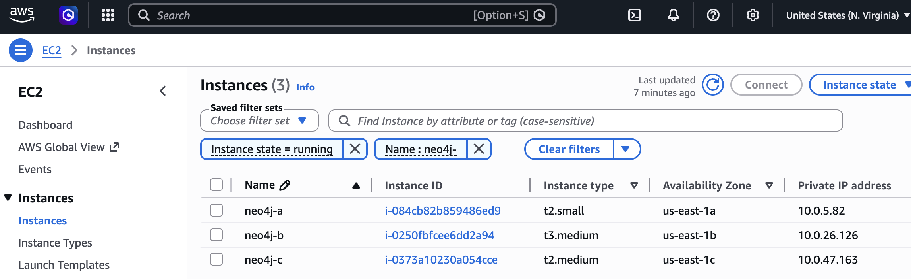
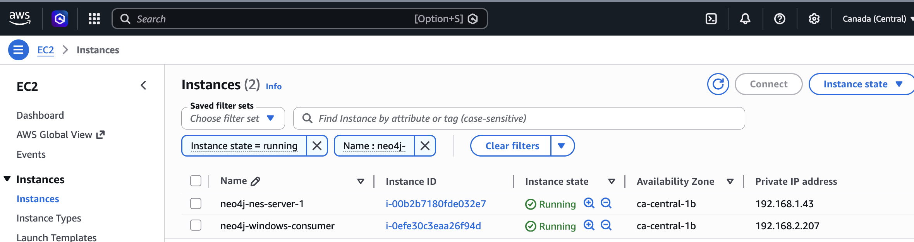

# Architecture Overview

## Infrastructure Layout

This setup exposes a 3-node Neo4j Enterprise cluster (one node per Availability Zone in `us-east-1`) from a **Provider VPC** to a **Consumer VPC** using AWS PrivateLink. All client traffic flows over **port 443** only, eliminating the need to open non-standard ports across VPC boundaries.

### Provider VPC (Neo4j Cluster Side)

| Instance | AZ | Role | Private IP |
|---|---|---|---|
| `east-a.neo4jfield.org` | us-east-1a | Neo4j Primary + HAProxy | 10.0.5.82 |
| `east-b.neo4jfield.org` | us-east-1b | Neo4j Primary + HAProxy | 10.0.26.126 |
| `east-c.neo4jfield.org` | us-east-1c | Neo4j Primary + HAProxy | 10.0.47.163 |

- **HAProxy** is co-located on all 3 nodes. It terminates TLS on port 443 and routes traffic based on SNI hostname to Neo4j HTTPS (`:7473`) or Bolt (`:7687`).



### Consumer VPC (Client Side)

The consumer VPC is in the same or a different AWS account/region. Clients access Neo4j through **VPC Interface Endpoints** that point to the PrivateLink endpoint services in the Provider VPC.



---

## Approach 1: HAProxy Architecture

```
Consumer VPC
  ├── Neo4j Browser (HTTPS)
  │    └── https://privatelink.neo4jfield.org
  │         └── Interface Endpoint → PrivateLink → NLB (port 443)
  │              └── HAProxy (SNI: privatelink.neo4jfield.org) → Neo4j :7473
  │
  └── Application (Bolt driver)
       ├── Initial connect: neo4j+s://privatelink.neo4jfield.org:443
       │    └── Routes to HAProxy → Neo4j :7687 (returns routing table)
       └── Per-node Bolt (from routing table):
            ├── east-a.neo4jfield.org:7687 → PrivateLink Bolt-1 → NLB → Node A :7687
            ├── east-b.neo4jfield.org:7687 → PrivateLink Bolt-2 → NLB → Node B :7687
            └── east-c.neo4jfield.org:7687 → PrivateLink Bolt-3 → NLB → Node C :7687

Provider VPC
  ├── NLB (HTTPS)  → HAProxy on Node A or B (port 443)
  ├── NLB Bolt-1   → Node A :7687
  ├── NLB Bolt-2   → Node B :7687
  └── NLB Bolt-3   → Node C :7687
```

### Why SNI-Based Routing?

AWS PrivateLink and NLBs operate at Layer 4 (TCP), passing TLS traffic opaque. HAProxy terminates TLS on port 443 and inspects the **Server Name Indication (SNI)** field in the TLS ClientHello to determine which backend to forward traffic to:

| SNI hostname | Backend |
|---|---|
| `privatelink.neo4jfield.org` | Neo4j HTTPS on `:7473` |
| `east-a.neo4jfield.org` (or `east-bolt.neo4jfield.org`) | Neo4j Bolt on `:7687` |

This allows both the Neo4j Browser (HTTPS) and Bolt protocol to share a single port 443 endpoint.

---

## Approach 2: NES Architecture (No HAProxy)

```
Consumer VPC
  └── Neo4j Enterprise Studio (NES) — installed in consumer VPC
       └── bolt+s://east-a.neo4jfield.org:443
            └── Interface Endpoint → PrivateLink → NLB (port 443)
                 └── Neo4j Node A :7687 (NLB maps 443 → 7687)

       Per-node routing (from Neo4j routing table):
            ├── east-a.neo4jfield.org:443 → PrivateLink Bolt-1 → NLB → Node A :7687
            ├── east-b.neo4jfield.org:443 → PrivateLink Bolt-2 → NLB → Node B :7687
            └── east-c.neo4jfield.org:443 → PrivateLink Bolt-3 → NLB → Node C :7687

Provider VPC
  ├── NLB Bolt-1 (listener :443 → target :7687) → Node A
  ├── NLB Bolt-2 (listener :443 → target :7687) → Node B
  └── NLB Bolt-3 (listener :443 → target :7687) → Node C
```

In this approach:
- HAProxy is **not needed**
- NLBs perform port mapping: listener TCP 443 → target group TCP 7687
- Neo4j advertises bolt addresses on port 443 (so the routing table returned to clients uses port 443)
- NES runs inside the consumer VPC and provides the full UI (browser, Bloom, dashboards)

---

## AWS PrivateLink Endpoint Services

### Approach 1 — 4 Endpoint Services

| Endpoint Service | NLB | Private DNS Name | Purpose |
|---|---|---|---|
| `svc-neo4j-https` | `nlb-neo4j-https` | `privatelink.neo4jfield.org` | Browser + Bolt via HAProxy |
| `svc-neo4j-bolt-a` | `nlb-neo4j-bolt-a` | `east-a.neo4jfield.org` | Node A Bolt |
| `svc-neo4j-bolt-b` | `nlb-neo4j-bolt-b` | `east-b.neo4jfield.org` | Node B Bolt |
| `svc-neo4j-bolt-c` | `nlb-neo4j-bolt-c` | `east-c.neo4jfield.org` | Node C Bolt |

### Approach 2 — 3 Endpoint Services (Bolt only)

| Endpoint Service | NLB | Private DNS Name | Purpose |
|---|---|---|---|
| `svc-neo4j-bolt-a` | `nlb-neo4j-bolt-a` (443→7687) | `east-a.neo4jfield.org` | Node A Bolt on 443 |
| `svc-neo4j-bolt-b` | `nlb-neo4j-bolt-b` (443→7687) | `east-b.neo4jfield.org` | Node B Bolt on 443 |
| `svc-neo4j-bolt-c` | `nlb-neo4j-bolt-c` (443→7687) | `east-c.neo4jfield.org` | Node C Bolt on 443 |

---

## Route 53 Private Hosted Zone (Provider VPC Only)

The PHZ resolves DNS for intra-cluster communication within the Provider VPC.

| Record | Type | Value | Purpose |
|---|---|---|---|
| `east-a.neo4jfield.org` | A | `10.0.5.82` | Node A internal resolution |
| `east-b.neo4jfield.org` | A | `10.0.26.126` | Node B internal resolution |
| `east-c.neo4jfield.org` | A | `10.0.47.163` | Node C internal resolution |
| `privatelink.neo4jfield.org` | A | `10.0.5.82` | HAProxy (primary) internal resolution |

> **Critical:** Associate the PHZ **only with the Provider VPC**. Never associate it with the Consumer VPC. Doing so causes DNS in the Consumer VPC to return Provider VPC private IPs (unreachable), overriding the Interface Endpoint's private DNS.

---

## Security Groups

### Provider VPC — Neo4j Nodes

| Port | Protocol | Source | Purpose |
|---|---|---|---|
| 443 | TCP | NLB security group / VPC CIDR | HAProxy (PrivateLink entry) |
| 7473 | TCP | VPC CIDR | Neo4j HTTPS (HAProxy → Neo4j) |
| 7687 | TCP | VPC CIDR | Neo4j Bolt (internal + PrivateLink) |
| 6000 | TCP | VPC CIDR | Cluster discovery |
| 7000 | TCP | VPC CIDR | RAFT consensus |
| 7688 | TCP | VPC CIDR | Routing protocol |
| 22 | TCP | Bastion / admin CIDR | SSH access |

### Consumer VPC — Interface Endpoint

| Port | Protocol | Source | Purpose |
|---|---|---|---|
| 443 | TCP | App / client CIDR | HTTPS + Bolt via HAProxy |
| 7687 | TCP | App / client CIDR | Bolt direct (Approach 1 Bolt endpoints) |
