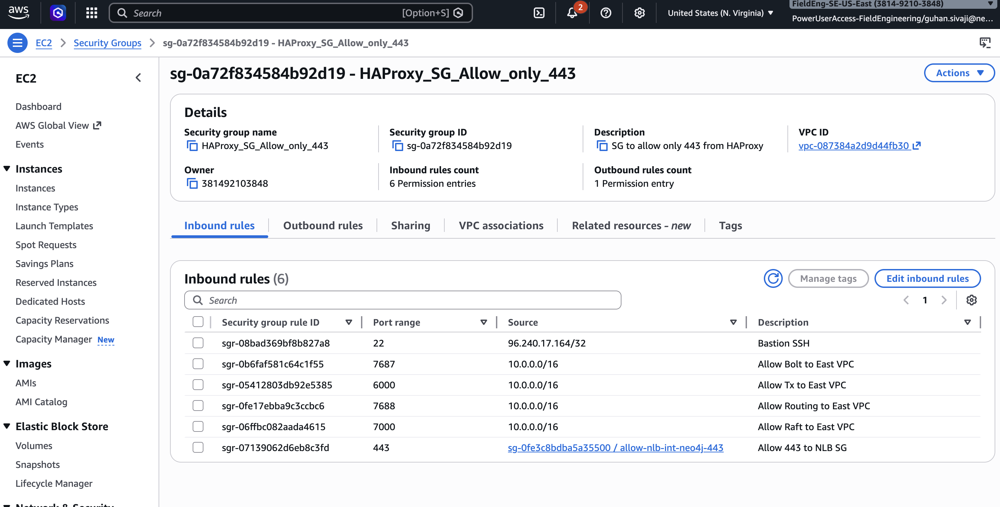
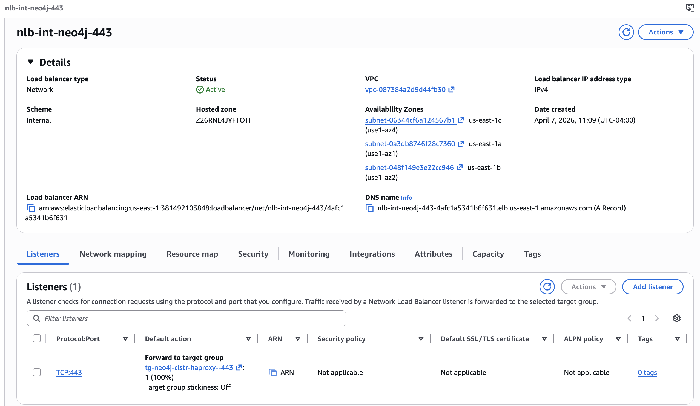
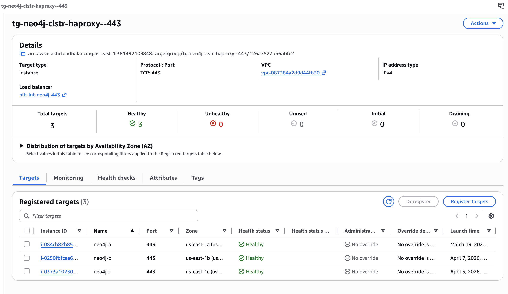
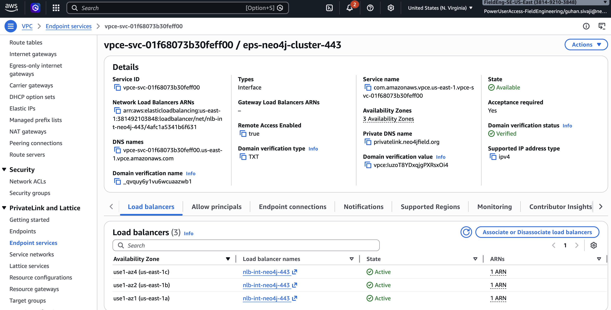
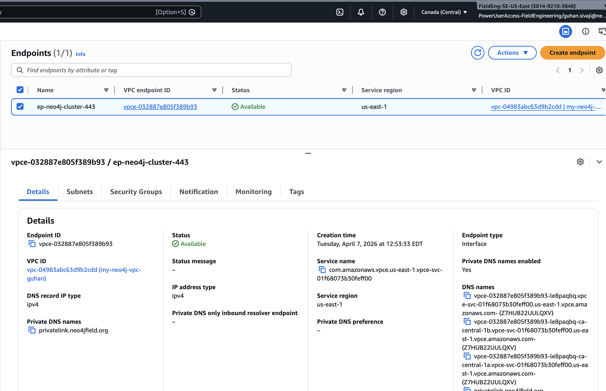
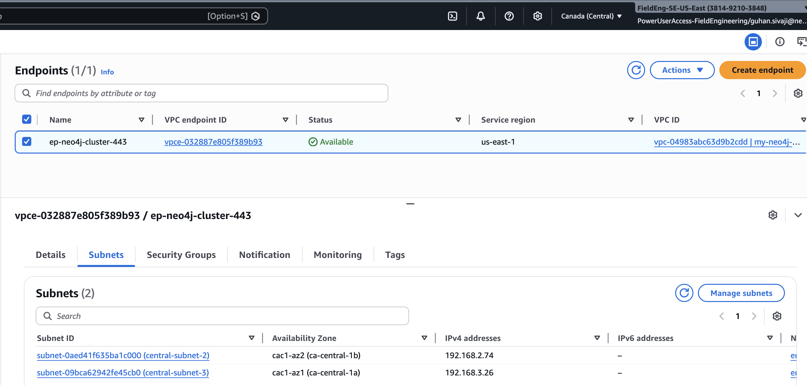
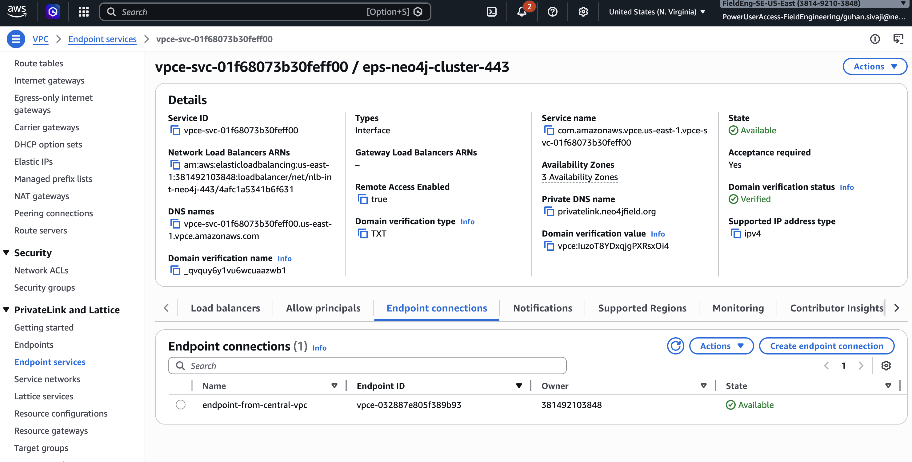
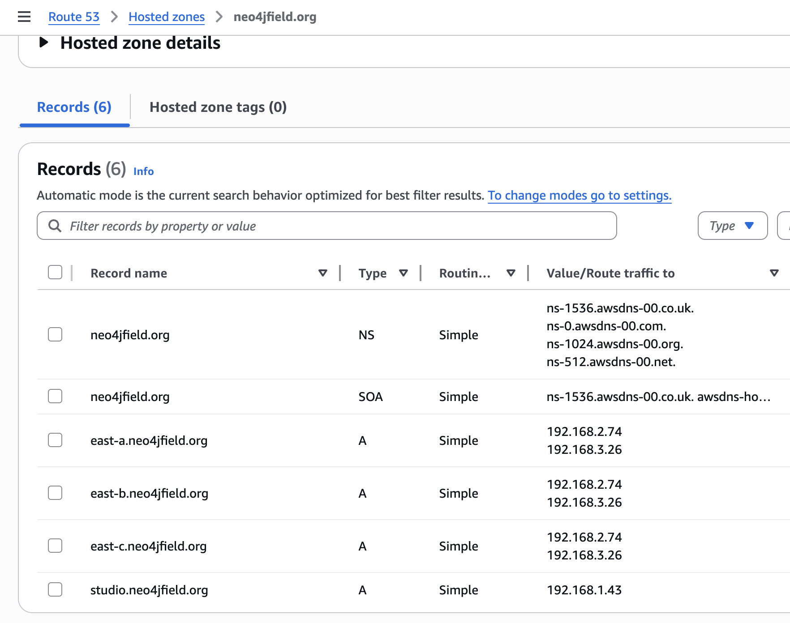
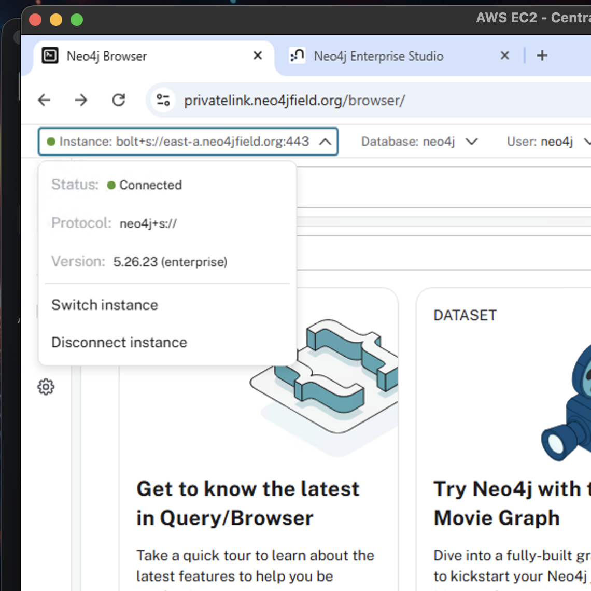
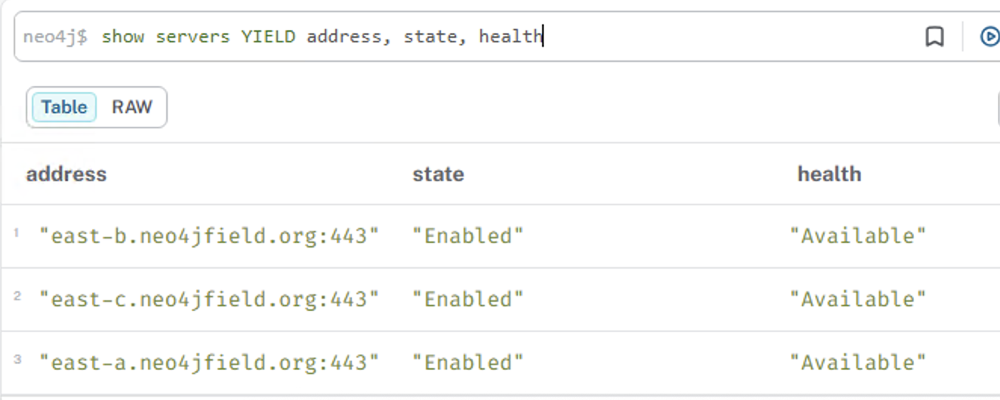

# Approach 1 — HAProxy + NLB + PrivateLink

## Overview

In this approach, HAProxy is installed on the same EC2 instances as Neo4j (Nodes A and B). It listens on port 443, terminates TLS, and routes traffic to the correct backend (Neo4j Browser or Bolt) based on the **SNI hostname** in the TLS handshake. An AWS Network Load Balancer (NLB) fronts the HAProxy instances, and AWS PrivateLink connects the Consumer VPC to the Provider VPC.

**Result:** Consumers access both the Neo4j Browser (HTTPS) and Bolt over a single port 443 endpoint.

---

## Part 1 — Neo4j Installation and Configuration

### 1.1 Install Neo4j Enterprise on Each Node

```bash
# Add the Neo4j RPM repository (Amazon Linux 2023)
sudo rpm --import https://debian.neo4j.com/neotechnology.gpg.key
sudo tee /etc/yum.repos.d/neo4j.repo <<'EOF'
[neo4j]
name=Neo4j RPM Repository
baseurl=https://yum.neo4j.com/stable/5
enabled=1
gpgcheck=1
EOF

sudo dnf install neo4j-enterprise -y
sudo systemctl enable neo4j
```

### 1.2 Place TLS Certificates

The same wildcard certificate (e.g. `*.neo4jfield.org`) is used for both Bolt and HTTPS. Place the certificate and private key on each node:

```bash
sudo mkdir -p /var/lib/neo4j/certificates/bolt
sudo mkdir -p /var/lib/neo4j/certificates/https

# Replace with your actual certificate and key files
sudo cp public.crt  /var/lib/neo4j/certificates/bolt/public.crt
sudo cp private.key /var/lib/neo4j/certificates/bolt/private.key
sudo cp public.crt  /var/lib/neo4j/certificates/https/public.crt
sudo cp private.key /var/lib/neo4j/certificates/https/private.key

sudo chown -R neo4j:neo4j /var/lib/neo4j/certificates/
sudo chmod 600 /var/lib/neo4j/certificates/bolt/private.key
sudo chmod 600 /var/lib/neo4j/certificates/https/private.key
```

### 1.3 Configure neo4j.conf

Copy the appropriate sample configuration and place it at `/etc/neo4j/neo4j.conf`:

| Node | Sample config |
|---|---|
| Node A (us-east-1a) | [`config/approach-1-haproxy/node-a/neo4j.conf`](../config/approach-1-haproxy/node-a/neo4j.conf) |
| Node B (us-east-1b) | [`config/approach-1-haproxy/node-b/neo4j.conf`](../config/approach-1-haproxy/node-b/neo4j.conf) |
| Node C (us-east-1c) | [`config/approach-1-haproxy/node-c/neo4j.conf`](../config/approach-1-haproxy/node-c/neo4j.conf) |

**Key settings and their purpose:**

| Setting | Value (Node A) | Why |
|---|---|---|
| `server.bolt.advertised_address` | `east-a.neo4jfield.org:7687` | Bolt address returned in routing table — must resolve via PrivateLink in consumer VPC |
| `server.https.advertised_address` | `privatelink.neo4jfield.org:7473` | HTTPS address exposed to clients via the shared HAProxy endpoint |
| `server.cluster.advertised_address` | `10.0.5.82:6000` | Private IP for intra-VPC cluster discovery (not exposed outside the VPC) |
| `server.bolt.tls_level` | `REQUIRED` | All Bolt connections must use TLS |
| `server.http.enabled` | `false` | Plain HTTP disabled — HTTPS only |
| `dbms.cluster.discovery.version` | `V2_ONLY` | Required for LIST-based discovery in Neo4j 5.x |
| `dbms.cluster.discovery.v2.endpoints` | all 3 private IPs on port 6000 | Seed list for cluster formation |

> **Design rationale — private IPs for cluster, DNS for bolt:** Cluster discovery and RAFT use private IPs because these are intra-VPC communications that never leave the Provider VPC. Bolt advertised addresses use DNS names because these are returned to consumers in the routing table, and consumers reach them via PrivateLink (which resolves DNS to ENI IPs in the Consumer VPC).

The security group on each Neo4j node should allow the cluster ports within the VPC CIDR, and port 443 inbound from the NLB security group:



### 1.4 Start the Cluster

Start Neo4j on all three nodes (order does not matter):

```bash
sudo neo4j start
sudo neo4j status

# Monitor cluster formation
sudo tail -f /var/log/neo4j/neo4j.log
# Look for: "Connected to 10.0.x.x [Category[name=RAFT] version:3.0]"
```

Verify cluster health:

```cypher
SHOW SERVERS
```

Expected: 3 servers, all `Enabled` and `Available`.

---

## Part 2 — HAProxy Installation and Configuration

HAProxy is installed on **all 3 nodes**. Each node runs both Neo4j and HAProxy, with HAProxy listening on port 443 and routing traffic to the local Neo4j instance via SNI.

### 2.1 Install HAProxy

```bash
# Amazon Linux 2023
sudo dnf install haproxy -y
sudo systemctl enable haproxy
```

Verify the version (2.x or later recommended):

```bash
haproxy -v
```

### 2.2 Prepare the TLS Certificate for HAProxy

HAProxy requires the certificate and private key concatenated into a single `.pem` file. This is different from the Neo4j cert format.

```bash
sudo mkdir -p /etc/haproxy/certs

# Concatenate: full chain (leaf + intermediates) first, then private key
cat fullchain.crt private.key | sudo tee /etc/haproxy/certs/neo4jfield.org.pem
sudo chmod 600 /etc/haproxy/certs/neo4jfield.org.pem
sudo chown haproxy:haproxy /etc/haproxy/certs/neo4jfield.org.pem
```

> If your CA provides separate files, create the chain: `cat leaf.crt intermediate.crt root.crt > fullchain.crt` first.

### 2.3 Deploy the HAProxy Configuration

Copy the appropriate sample configuration to `/etc/haproxy/haproxy.cfg`:

| Node | Sample config |
|---|---|
| Node A | [`config/approach-1-haproxy/node-a/haproxy.cfg`](../config/approach-1-haproxy/node-a/haproxy.cfg) |
| Node B | [`config/approach-1-haproxy/node-b/haproxy.cfg`](../config/approach-1-haproxy/node-b/haproxy.cfg) |

**How the SNI routing works:**

```
Client connects to: https://privatelink.neo4jfield.org  (SNI = privatelink.neo4jfield.org)
  → HAProxy routes to: be_neo4j_https → 127.0.0.1:7473

Client connects to: neo4j+s://east-a.neo4jfield.org:443  (SNI = east-a.neo4jfield.org)
  → HAProxy routes to: be_neo4j_bolt → 127.0.0.1:7687
```

HAProxy terminates the client TLS connection, then opens a **new** TLS connection to Neo4j (`ssl verify none` — safe because both are on the same host). This is required because Neo4j has `server.bolt.tls_level=REQUIRED` and only serves HTTPS (not HTTP).

### 2.4 Validate and Start HAProxy

```bash
# Validate configuration syntax
sudo haproxy -c -f /etc/haproxy/haproxy.cfg

# Start / reload
sudo systemctl start haproxy
sudo systemctl status haproxy

# Reload without dropping connections (use after config changes)
sudo systemctl reload haproxy
```

Verify HAProxy is listening on port 443:

```bash
ss -tlnp | grep 443
```

---

## Part 3 — AWS Network Load Balancers

You need **4 NLBs** in the Provider VPC — one for the shared HTTPS/Bolt entry point (via HAProxy) and one per Neo4j node for dedicated Bolt access.

### 3.1 NLB for HTTPS via HAProxy (`nlb-neo4j-https`)

Create this NLB in the AWS Console or CLI:

| Setting | Value |
|---|---|
| Type | Internal |
| Subnets | One subnet per AZ — use the AZ of each Neo4j node |
| Listener | TCP port **443** |
| Target group | TCP port **443** |
| Targets | Node A private IP (`10.0.5.82`) and Node B private IP (`10.0.26.126`) |
| Health check | TCP port 443 |

> **Why 2 subnets on the HTTPS NLB?** An NLB operates in each AZ independently. By specifying a subnet in both `us-east-1a` and `us-east-1b`, the NLB can route traffic to the HAProxy instance in the closest AZ. If one AZ's HAProxy becomes unhealthy, traffic automatically shifts to the other. This is the core of high availability — always configure at least 2 subnets on any NLB that fronts a redundant service.





### 3.2 NLBs for Bolt (one per node)

Create 3 separate NLBs, each targeting a single Neo4j node on the Bolt port:

| NLB Name | AZ | Target IP | Listener Port | Target Port |
|---|---|---|---|---|
| `nlb-neo4j-bolt-a` | us-east-1a | `10.0.5.82` | **7687** | 7687 |
| `nlb-neo4j-bolt-b` | us-east-1b | `10.0.26.126` | **7687** | 7687 |
| `nlb-neo4j-bolt-c` | us-east-1c | `10.0.47.163` | **7687** | 7687 |

> **Why separate per-node NLBs for Bolt?** Neo4j's routing protocol (`SHOW SERVERS`) returns individual node addresses (`east-a.neo4jfield.org:7687`, `east-b.neo4jfield.org:7687`, `east-c.neo4jfield.org:7687`). Drivers use these addresses to connect directly to specific nodes (e.g. to reach the leader for writes). Each node needs its own PrivateLink endpoint so consumers can reach it independently. A shared NLB would not allow per-node routing.

---

## Part 4 — AWS PrivateLink Endpoint Services

### 4.1 Create an Endpoint Service

For each NLB, create a corresponding PrivateLink endpoint service:

AWS Console → VPC → PrivateLink and Lattice → Endpoint services → **Create endpoint service**

| Setting | Value |
|---|---|
| Load balancer type | Network |
| Available load balancers | Select the NLB |
| Acceptance required | Yes (recommended for production) |
| Supported IP address types | IPv4 |
| Private DNS name | See table below |

### 4.2 Endpoint Service Summary

| Service Name | NLB | Private DNS Name | Purpose |
|---|---|---|---|
| `svc-neo4j-https` | `nlb-neo4j-https` | `privatelink.neo4jfield.org` | Browser + Bolt via HAProxy |
| `svc-neo4j-bolt-a` | `nlb-neo4j-bolt-a` | `east-a.neo4jfield.org` | Node A Bolt |
| `svc-neo4j-bolt-b` | `nlb-neo4j-bolt-b` | `east-b.neo4jfield.org` | Node B Bolt |
| `svc-neo4j-bolt-c` | `nlb-neo4j-bolt-c` | `east-c.neo4jfield.org` | Node C Bolt |



### 4.3 Verify the Private DNS Name

Each private DNS name requires domain verification before consumers can use it. AWS provides a TXT record value:

1. Note the TXT record shown in the endpoint service details
2. Add the TXT record to your **public** DNS for `neo4jfield.org` (this verifies domain ownership)
3. Wait for the AWS console to show **Verified** status (typically a few minutes)

### 4.4 Allow Consumer Accounts

Under each endpoint service → **Allow principals**, add the consumer's AWS account ARN:

```
arn:aws:iam::<CONSUMER_ACCOUNT_ID>:root
```

Or use `*` to allow any account (only appropriate in controlled internal environments).

---

## Part 5 — Route 53 Private Hosted Zone (Provider VPC)

### 5.1 Create the PHZ

AWS Console → Route 53 → Hosted zones → **Create hosted zone**:

| Field | Value |
|---|---|
| Domain name | `neo4jfield.org` |
| Type | **Private hosted zone** |
| VPC | Provider VPC (us-east-1) |

### 5.2 Add DNS Records

| Record name | Type | Value | TTL |
|---|---|---|---|
| `east-a.neo4jfield.org` | A | `10.0.5.82` | 300 |
| `east-b.neo4jfield.org` | A | `10.0.26.126` | 300 |
| `east-c.neo4jfield.org` | A | `10.0.47.163` | 300 |
| `privatelink.neo4jfield.org` | A | `10.0.5.82` | 300 |

> `privatelink.neo4jfield.org` points to Node A's IP (primary HAProxy). The NLB distributes traffic across Node A and B at the network level; this PHZ record is only used **within the Provider VPC** (e.g. when Neo4j nodes reference this hostname internally).

### 5.3 Critical: Do NOT Associate the PHZ with the Consumer VPC

**Only associate this PHZ with the Provider VPC.**

If you associate it with the Consumer VPC:
- DNS lookups for `privatelink.neo4jfield.org` return `10.0.5.82` — a Provider VPC private IP unreachable from the Consumer VPC
- This overrides the Interface Endpoint's private DNS resolution
- Result: all PrivateLink connectivity breaks

The Consumer VPC gets DNS resolution automatically through the Interface Endpoint's **Enable private DNS name** feature.

---

## Part 6 — Consumer VPC: Interface Endpoints

### 6.1 Create Interface Endpoints

For each endpoint service, create a corresponding Interface Endpoint in the Consumer VPC:

AWS Console → VPC → Endpoints → **Create endpoint**

| Field | Value |
|---|---|
| Service category | Other endpoint services |
| Service name | Paste the endpoint service name (e.g. `com.amazonaws.vpce.us-east-1.vpce-svc-xxxxxxxxx`) |
| VPC | Consumer VPC |
| Subnets | **Select subnets in at least 2 AZs** (see note below) |
| Enable private DNS name | **Yes** — this is critical |
| Security group | Allow inbound TCP 443 from app/client CIDRs |

> **Why 2 subnets on the Interface Endpoint?** An Interface Endpoint creates an ENI (Elastic Network Interface) in each specified subnet. If one AZ becomes unavailable, clients in other AZs continue to reach the endpoint via the ENI in a healthy AZ. With only 1 subnet, a single AZ failure takes down the entire PrivateLink connection. Always configure at least 2 subnets (in different AZs) for production endpoints.





### 6.2 Consumer Endpoint Summary

| Endpoint | Service | Private DNS | Enable DNS |
|---|---|---|---|
| `ep-neo4j-https` | `svc-neo4j-https` | `privatelink.neo4jfield.org` | Yes |
| `ep-neo4j-bolt-a` | `svc-neo4j-bolt-a` | `east-a.neo4jfield.org` | Yes |
| `ep-neo4j-bolt-b` | `svc-neo4j-bolt-b` | `east-b.neo4jfield.org` | Yes |
| `ep-neo4j-bolt-c` | `svc-neo4j-bolt-c` | `east-c.neo4jfield.org` | Yes |

### 6.3 Accept the Endpoint Connections

If **Acceptance required** is enabled on the endpoint services:

1. Provider side: VPC → PrivateLink → Endpoint services → select service → **Endpoint connections** tab
2. Select the pending connection → **Actions → Accept endpoint connection**
3. State changes from `pending acceptance` → `available`



---

## Part 7 — Consumer VPC: Route 53 PHZ (Optional)

If the consumer VPC is in a different account or the Interface Endpoint private DNS does not automatically propagate, create a Route 53 Private Hosted Zone in the Consumer VPC:

| Record | Type | Value |
|---|---|---|
| `privatelink.neo4jfield.org` | A (Alias) | Interface Endpoint DNS name for `ep-neo4j-https` |
| `east-a.neo4jfield.org` | A (Alias) | Interface Endpoint DNS name for `ep-neo4j-bolt-a` |
| `east-b.neo4jfield.org` | A (Alias) | Interface Endpoint DNS name for `ep-neo4j-bolt-b` |
| `east-c.neo4jfield.org` | A (Alias) | Interface Endpoint DNS name for `ep-neo4j-bolt-c` |

Associate this PHZ **only with the Consumer VPC**.



---

## Part 8 — Verification

### 8.1 From the Provider VPC

```bash
# Verify cluster node DNS resolution (intra-VPC via PHZ)
for h in east-a.neo4jfield.org east-b.neo4jfield.org east-c.neo4jfield.org; do
  echo -n "$h -> "; dig +short $h
done

# Verify HAProxy is listening on :443
ss -tlnp | grep 443

# Verify Neo4j is healthy
sudo neo4j status
sudo tail -20 /var/log/neo4j/neo4j.log | grep -E "Connected|RAFT|Started"
```

### 8.2 From the Consumer VPC

```bash
# Test HTTPS endpoint
nc -zv privatelink.neo4jfield.org 443

# Test per-node Bolt endpoints — all exposed on port 443 via PrivateLink
nc -zv east-a.neo4jfield.org 443
nc -zv east-b.neo4jfield.org 443
nc -zv east-c.neo4jfield.org 443
```

```powershell
# PowerShell
Test-NetConnection -ComputerName privatelink.neo4jfield.org -Port 443
Test-NetConnection -ComputerName east-a.neo4jfield.org -Port 443
```

### 8.3 Neo4j Browser

Navigate to:
```
https://privatelink.neo4jfield.org/browser/
```

Connect with:
- **Connect URL:** `neo4j+s://east-a.neo4jfield.org:443`
- **Username:** `neo4j`
- **Password:** `<your password>`



After login:

```cypher
SHOW SERVERS
```
Expected: 3 servers, all `Enabled` and `Available`.



```cypher
SHOW DATABASES
```
Expected: `neo4j` database `online` on all 3 nodes.

---

## Part 9 — Troubleshooting

### Routing table empty / Red dot in Neo4j Browser

**Symptom:** `ServiceUnavailable: No routing servers available`

| Cause | Fix |
|---|---|
| One or more Neo4j nodes not running | `sudo neo4j start` on each node |
| `dbms.cluster.discovery.v2.endpoints` commented out | Uncomment and restart |
| PHZ associated with Consumer VPC | Remove Consumer VPC from PHZ associations |
| Wrong `server.bolt.advertised_address` | Ensure it uses DNS names (not IPs), resolvable from consumer via PrivateLink |

### HAProxy rejecting connections (no SNI match)

**Symptom:** TLS handshake fails immediately at port 443

```bash
# Check which SNI hostnames HAProxy accepts
sudo grep 'sni_' /etc/haproxy/haproxy.cfg
# The client's hostname must exactly match one of these ACL values
```

### DNS returns wrong IP in Consumer VPC

**Symptom:** `dig east-a.neo4jfield.org` returns `10.0.5.82` instead of an ENI IP (`192.168.x.x`)

**Cause:** The Provider PHZ is associated with the Consumer VPC.

**Fix:** Route 53 → Hosted zones → `neo4jfield.org` → Edit → remove Consumer VPC.

### Store ID mismatch / node quarantine

**Symptom:** One node shows `unknown` / `Server is unavailable` in `SHOW DATABASES`

```bash
sudo neo4j stop
sudo rm -rf /var/lib/neo4j/data/databases/neo4j/
sudo rm -rf /var/lib/neo4j/data/transactions/neo4j/
sudo rm -rf /var/lib/neo4j/data/cluster-state/db/neo4j/
sudo neo4j start
# Neo4j will re-seed the database from the other healthy nodes
```
