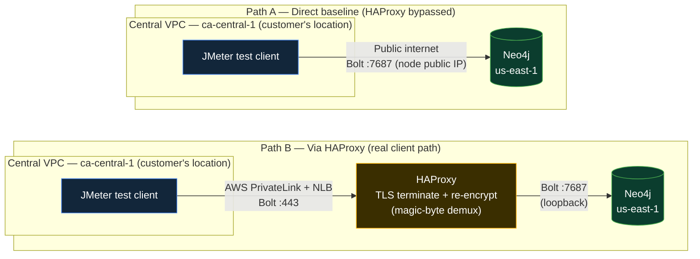

# Performance Testing: HAProxy vs Direct (Bolt)

A JMeter test plan a customer can run themselves to answer one question: **how much latency does HAProxy add?**

It runs real Bolt-protocol queries against Neo4j, once **via HAProxy on port 443** (the real client path in Approach 1 and Approach 3, HAProxy demuxes on the Bolt magic bytes and forwards to loopback `7687`) and once **directly against Neo4j's native Bolt port `7687`, with HAProxy bypassed** (the baseline). Same query, same client, same dataset. The variable is whether HAProxy sits in the path (and, in the cross-region profile below, whether the request stays on AWS's backbone or crosses the public internet).

This works unchanged whichever config variant is deployed ([`approach-1-haproxy`](../config/approach-1-haproxy/), [`approach-3-lts-single-instance`](../config/approach-3-lts-single-instance/), or [`approach-3-lts-cluster-tls-bridging`](../config/approach-3-lts-cluster-tls-bridging/)), all of them front the same Neo4j Bolt port `7687` with HAProxy on `443`.

> **JMeter has no native Bolt sampler.** There's no HTTP request/response to drive, just a TLS handshake, a 4-byte Bolt handshake, then PackStream-encoded messages. Each sample here is a **JSR223 (Groovy) Sampler backed by the official `neo4j-java-driver`**, so the numbers reflect what a real Bolt client experiences, not a hand-rolled reimplementation of the wire protocol. See [The test plan](#the-test-plan) below.

> **Looking for the HTTP Query API v2 variant instead?** An earlier version of this test compared Neo4j's HTTP Query API v2 on port `7473` (direct) vs `443` (via HAProxy), isolating HAProxy's own cost with client and server on the same box. That test plan, its setup script, and its validated `c5.4xlarge` results are still here: [`jmeter/HAProxy-vs-Direct-Neo4j.jmx`](jmeter/HAProxy-vs-Direct-Neo4j.jmx), [`results/2026-07-14-validated-run.md`](results/2026-07-14-validated-run.md). Useful if you want an HTTP-level number, or want to isolate HAProxy's cost alone rather than the full cross-region comparison this doc now covers.

> **Approach 2 (NES, no HAProxy) is out of scope here.** A fair comparison against NES needs its own driver-based script (see [`examples/`](../examples/)), since NES sits outside the HAProxy/PrivateLink path this test plan exercises.

---

## Test topology

The two paths, one per row, same client, same query, same dataset. The difference is whether HAProxy is in the request path, and which network the request travels:



**Path A** measures Neo4j's raw response time with HAProxy bypassed, tested here from the Central VPC client over the public internet, direct to the node's public IP on `7687` (the topology of the [validated run below](#validated-example-run)). **Path B** is the customer's actual path, the same client in the Central VPC, over AWS PrivateLink, hitting HAProxy on `443`. HAProxy terminates TLS and re-encrypts to Neo4j on loopback (see [`config/approach-3-lts-cluster-tls-bridging/README.md`](../config/approach-3-lts-cluster-tls-bridging/README.md) for how the TLS-bridging + magic-byte demux works). **B minus A is HAProxy's cost plus whatever the network path itself adds**, see the note below.

**A note on isolating variables:** the diagram above (and the [validated run below](#validated-example-run), [`results/2026-07-15-bolt-validated-run.md`](results/2026-07-15-bolt-validated-run.md)) puts the Path A client in the Central VPC, reaching the node's public IP over the public internet. That measures the real end-to-end tradeoff a customer faces (expose Bolt directly to the internet vs. go through PrivateLink + HAProxy), but it bundles PrivateLink/cross-region network cost in with HAProxy's cost. To isolate HAProxy alone, run *both* paths from inside the Provider VPC instead (private IP for both, `7687` reachable that way without opening it publicly). Run both profiles if you want to report each number separately: "HAProxy's own overhead" vs. "the full path a customer actually experiences."

---

## Test data

The test defaults to a real indexed point lookup against a small synthetic dataset, not `RETURN 1`. Seed it once before running:

```bash
cypher-shell -a bolt+ssc://<host>:7687 -u neo4j -p '<password>' -f seed-data.cypher
```

This creates 10,000 `:PerfTestPerson` nodes (unique-constrained on `id`, grouped into 20 synthetic cities with a `FOLLOWS` ring per city), see [`seed-data.cypher`](seed-data.cypher). The default query is:

```cypher
MATCH (p:PerfTestPerson {id: $id}) RETURN p.id AS id, p.name AS name, p.email AS email, p.city AS city
```

with `id` randomized per request (1 to 10000, via a random integer per sample) so load spreads across the dataset instead of hammering one page-cached node. Two heavier alternatives (a non-indexed filtered scan, and a 1-hop relationship traversal) are in [`queries.md`](queries.md) if you want the comparison under more realistic query cost.

Neo4j's Bolt listener here requires TLS (`server.bolt.tls_level=REQUIRED`), so both paths use `bolt+ssc://` (encrypted, skipping cert/hostname verification, since the wildcard cert covers `*.neo4jfield.org` rather than a raw IP), not `bolt+s://`. Both use single-target `bolt://`-style addressing, not `neo4j://` routing, since this measures one node's request latency, not cluster-wide load balancing.

---

## Why JMeter

Purpose-built for exactly this: N concurrent virtual users, statistically meaningful latency distribution under load, an Aggregate Report / HTML Dashboard with full percentile breakdown (p90/p95/p99) and throughput, the numbers that actually matter when telling a customer whether HAProxy's overhead is acceptable. A single script issuing one request at a time can't produce a percentile distribution under concurrency; JMeter can, out of the box, once it's driving the real protocol via the driver (see above).

---

## Prerequisites

1. **A test-runner host with JMeter and the Neo4j driver installed.** [`setup-test-runner.sh`](setup-test-runner.sh) installs Java, JMeter 5.6.3, and drops `neo4j-java-driver` (a single shaded jar) into JMeter's `lib/` on a fresh RHEL/Amazon Linux host. Run it on whatever machine will actually issue the requests, a bastion in the same VPC as Neo4j for the isolated-HAProxy-cost profile, or the Central VPC client (e.g. `neo4j-nes-server-1`) for the cross-region profile.

2. **Neo4j reachable on two paths from that test-runner host:**
   - Via HAProxy: `bolt+ssc://<host>:443` (the normal client path, works from the Central VPC over the existing PrivateLink connection)
   - Direct: `bolt+ssc://<host>:7687`, Neo4j's native Bolt port, bypassing HAProxy entirely

   **If the test runner is inside the same VPC as Neo4j**, the private IP works for both paths with no security group changes. This isolates HAProxy's own cost (see [Test topology](#test-topology) above).

   **If the test runner is the Central VPC client**, the via-HAProxy path already works unchanged over PrivateLink. For the direct path, `7687` needs to be reachable from that client, either a temporary security group rule scoped to the client's IP (not `0.0.0.0/0` for anything beyond a short test window), or a broader rule if you're deliberately measuring the "exposed directly to the internet" scenario, in which case that exposure is the thing being measured, not a side effect to avoid.

3. **Test data seeded** (see [Test data](#test-data) above) and **Neo4j credentials** with read access to it.
4. The current IP/hostname of the target node, public IPs on these EC2 instances **change on restart**, confirm before each run.

---

## The test plan

**File:** [`jmeter/Bolt-HAProxy-vs-Direct.jmx`](jmeter/Bolt-HAProxy-vs-Direct.jmx)

Four Thread Groups, run in this order:

| Thread Group | Target | Counted in results? | Output |
|---|---|---|---|
| `00 - Warm-up (untracked)` | Both paths, `${WARMUP_THREADS}` threads x `${WARMUP_LOOPS}` loops (default 5x20 = 100 requests/path) | **No**, a Setup Thread Group with no listener attached, runs first and always, purely to get past JIT/connection-pool/page-cache cold start before anything is measured | *(none)* |
| `01 - Baseline (Direct Bolt 7687, HAProxy bypassed)` | `${DIRECT_HOST}:${DIRECT_PORT}` (default a current East node public IP : `7687`) | Yes | `results-direct.jtl` |
| `02 - Via HAProxy (Bolt over 443)` | `${VIA_HAPROXY_HOST}:${VIA_HAPROXY_PORT}` (default `privatelink.neo4jfield.org:443`) | Yes | `results-haproxy.jtl` |
| `99 - Teardown (close drivers)` | Closes both cached driver instances cleanly | No | *(none)* |

Each Thread Group creates **one shared `Driver` instance per target** (cached in JMeter's `props`, keyed by URI) the first time it's needed, and every sample opens a pooled `Session` off that driver, mirroring how a real application uses the driver (one long-lived `Driver`, many short `Session`s) rather than paying connection setup cost on every request.

Skipping the warm-up matters: cold-start effects (JIT, connection pool, page cache) show up as inflated early-sample latency that has nothing to do with HAProxy or Neo4j. `WARMUP_LOOPS=0` disables it if you deliberately want cold-start behavior included.

### Setup

1. Run [`setup-test-runner.sh`](setup-test-runner.sh), or install JMeter yourself and drop `neo4j-java-driver-5.26.0.jar` (or newer 5.x) into its `lib/` folder: https://jmeter.apache.org/download_jmeter.cgi, https://repo1.maven.org/maven2/org/neo4j/driver/neo4j-java-driver/
2. Seed the test data (see [Test data](#test-data)).
3. Open `Bolt-HAProxy-vs-Direct.jmx` in the JMeter GUI, or edit variables directly in the XML's "User Defined Variables", either way, set:
   - `DIRECT_HOST` / `DIRECT_PORT`, the direct Bolt path (default `7687`)
   - `VIA_HAPROXY_HOST` / `VIA_HAPROXY_PORT`, the HAProxy path (default `privatelink.neo4jfield.org` / `443`)
   - `NEO4J_DATABASE` / `NEO4J_USER` / `NEO4J_PASSWORD`
   - `SEED_MAX_ID`, must match however many `:PerfTestPerson` rows `seed-data.cypher` created (default 10000)
   - `CONNECT_TIMEOUT_SEC`, driver connection timeout (default 5)
   - `THREADS` / `RAMPUP` / `LOOPS`, concurrency profile (defaults: 10 threads, 5s ramp-up, 50 loops each = 500 requests per path)
   - `WARMUP_THREADS` / `WARMUP_LOOPS`, warm-up profile (default 5 threads x 20 loops = 100 untracked requests per path)

### Run

Non-GUI with an HTML dashboard report (what to actually hand a customer):
```bash
cd performance-testing/jmeter
jmeter -n -t Bolt-HAProxy-vs-Direct.jmx \
  -JDIRECT_HOST=<east-node-public-ip> -JDIRECT_PORT=7687 \
  -JVIA_HAPROXY_HOST=privatelink.neo4jfield.org -JVIA_HAPROXY_PORT=443 \
  -JNEO4J_PASSWORD='<password>' \
  -l results.jtl -e -o report/
open report/index.html   # macOS; xdg-open on Linux
```

The dashboard's **Statistics** table gives min/max/average/p90/p95/p99 and throughput per Thread Group, read the `01 - Baseline` row against the `02 - Via HAProxy` row directly.

### Override variables from the command line (no GUI editing needed)

```bash
jmeter -n -t Bolt-HAProxy-vs-Direct.jmx \
  -JDIRECT_HOST=<east-node-public-ip> -JDIRECT_PORT=7687 \
  -JVIA_HAPROXY_HOST=privatelink.neo4jfield.org -JVIA_HAPROXY_PORT=443 \
  -JNEO4J_PASSWORD='<password>' \
  -JTHREADS=25 -JRAMPUP=10 -JLOOPS=100 \
  -l results.jtl -e -o report/
```

All variables are wired through `${__P(name,default)}`, so every `-JNAME=value` above genuinely overrides the default.

---

## Recording and presenting results

Use [`results/results-template.md`](results/results-template.md) to record a run's direct-vs-via-HAProxy numbers and fill in the delta. It includes a short guide on what the numbers actually mean, worth reading before sending anything to a customer, since the headline number they'll ask about is p99, not the average.

### Validated example run

The test plan was run end-to-end (warm-up included) from the Central VPC client (`neo4j-nes-server-1`, ca-central-1, `c5.4xlarge`) against the live 3-node cluster in us-east-1, 10 threads, 500 measured requests per path (1,000 total), the direct path over the public internet to a node's public IP, the via-HAProxy path over the existing PrivateLink connection. Direct averaged 30.6ms versus 35.6ms via HAProxy, a consistent 3 to 6ms delta across every percentile from minimum through p99, with 0 errors on both paths. Full breakdown and interpretation in **[`results/2026-07-15-bolt-validated-run.md`](results/2026-07-15-bolt-validated-run.md)**.

Treat this as a first data point, not a universal verdict, it's a single run at modest concurrency (10 threads). Re-run at higher concurrency (25+ threads) before presenting a number as stable, and re-run against the customer's actual instance type and region pairing before quoting it for their specific deployment.

## Related

- [`seed-data.cypher`](seed-data.cypher): creates the `:PerfTestPerson` test dataset the plan queries against
- [`queries.md`](queries.md): the default point-lookup query plus two heavier alternatives (filtered scan, 1-hop traversal)
- [`setup-test-runner.sh`](setup-test-runner.sh): installs Java/JMeter/the Neo4j driver on a fresh test-runner host
- [`results/2026-07-15-bolt-validated-run.md`](results/2026-07-15-bolt-validated-run.md): full write-up of the cross-region validated run above
- [`jmeter/HAProxy-vs-Direct-Neo4j.jmx`](jmeter/HAProxy-vs-Direct-Neo4j.jmx) + [`results/2026-07-14-validated-run.md`](results/2026-07-14-validated-run.md): the earlier HTTP Query API v2 variant, same-box, isolates HAProxy's own cost
- [`docs/01-architecture.md`](../docs/01-architecture.md): overall PrivateLink/HAProxy architecture
- [`docs/04-comparison.md`](../docs/04-comparison.md): Approach 1 vs Approach 2 trade-offs
- [`examples/`](../examples/): Python Bolt-driver demos
