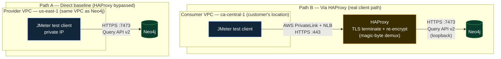

# Performance Testing — HAProxy vs Direct

A JMeter test plan a customer can run themselves to answer one question: **how much latency does HAProxy add?**

It hits Neo4j's [HTTP Query API v2](https://neo4j.com/docs/query-api/current/) (`POST /db/{database}/query/v2`) — once **via HAProxy on port 443** (the real client path in Approach 1 and Approach 3) and once **directly against Neo4j's native HTTPS port `7473`, with HAProxy bypassed** (the baseline). Same query, same client, same network — the only variable is whether HAProxy sits in the path. Whatever difference shows up in the results *is* HAProxy's cost.

This works unchanged whichever config variant is deployed ([`approach-1-haproxy`](../config/approach-1-haproxy/), [`approach-3-lts-single-instance`](../config/approach-3-lts-single-instance/), or [`approach-3-lts-cluster-tls-bridging`](../config/approach-3-lts-cluster-tls-bridging/)) — all of them front the same Neo4j HTTPS port `7473` with HAProxy on `443`.

> **Approach 2 (NES, no HAProxy) is out of scope here.** NES is Bolt-only with no HTTP surface, so it isn't reachable with JMeter's HTTP sampler — a fair comparison against NES needs a Bolt driver script (see [`examples/`](../examples/)), not an HTTP tool.

> **Bolt also works on 443 in Approaches 1 and 3 — this test doesn't cover that path.** HAProxy demuxes by peeking the first few bytes after TLS termination: Bolt's magic handshake (`60 60 B0 17`) routes to the Bolt backend, anything else routes to HTTPS — so a `bolt+s://` or `neo4j+s://` driver connecting on port 443 from the Central VPC works transparently, same port, same HAProxy. JMeter's HTTP sampler can't drive that path (no HTTP request is involved); it's already validated in [`examples/neo4j_privatelink_demo.py`](../examples/neo4j_privatelink_demo.py). If you want a load comparison for Bolt specifically, that needs a driver-based load generator (e.g. a small Python/Java script spinning up N sessions), not JMeter — ask if that's wanted and it can be added alongside this.

---

## Test topology

The two paths, side by side — same client, same query, same network; the only difference is whether HAProxy is in the request path:



**Path A** measures Neo4j's raw response time with nothing in front of it, tested from inside the Provider VPC (the only place port `7473` is reachable). **Path B** is the customer's actual path — a client in the Consumer VPC, over AWS PrivateLink, hitting HAProxy on `443`; HAProxy terminates TLS and re-encrypts to Neo4j on loopback (see [`config/approach-3-lts-cluster-tls-bridging/README.md`](../config/approach-3-lts-cluster-tls-bridging/README.md) for how the TLS-bridging + magic-byte demux works). **B minus A is HAProxy's cost** — that's the whole test.

**A note on isolating variables:** running Path B from the Consumer VPC (as diagrammed) measures the *customer's real end-to-end experience*, but it bundles PrivateLink/cross-VPC network cost in with HAProxy's cost. To isolate HAProxy alone, run *both* paths from inside the Provider VPC (private IP for both) — that's what the [validated example run](#validated-example-run) below does. Run both versions if you want to report each number separately: "HAProxy's own overhead" vs. "the full path a customer actually experiences."

---

## Test data

The test defaults to a real indexed point lookup against a small synthetic dataset, not `RETURN 1`. Seed it once before running:

```bash
cypher-shell -a bolt+ssc://<host>:7687 -u neo4j -p '<password>' -f seed-data.cypher
```

This creates 10,000 `:PerfTestPerson` nodes (unique-constrained on `id`, grouped into 20 synthetic cities with a `FOLLOWS` ring per city) — see [`seed-data.cypher`](seed-data.cypher). The default query is:

```cypher
MATCH (p:PerfTestPerson {id: $id}) RETURN p.id AS id, p.name AS name, p.email AS email, p.city AS city
```

with `id` randomized per request (1–10000, via JMeter's `__Random` function) so load spreads across the dataset instead of hammering one page-cached node. Two heavier alternatives (a non-indexed filtered scan, and a 1-hop relationship traversal) are in [`queries.md`](queries.md) if you want the comparison under more realistic query cost.

---

## Why JMeter

Purpose-built for exactly this: N concurrent virtual users, statistically meaningful latency distribution under load, an Aggregate Report / HTML Dashboard with full percentile breakdown (p90/p95/p99) and throughput — the numbers that actually matter when telling a customer whether HAProxy's overhead is acceptable. A single Postman/curl request can't produce a percentile distribution under concurrency; JMeter can, out of the box.

---

## Prerequisites

1. **A test-runner host with JMeter installed.** [`setup-test-runner.sh`](setup-test-runner.sh) installs Java and JMeter 5.6.3 on a fresh RHEL/Amazon Linux host — run it on whatever machine will actually issue the requests (a bastion in the same VPC as Neo4j, or Neo4j's own host for a same-box validation run).

2. **Neo4j reachable on two paths from that test-runner host:**
   - Via HAProxy: `https://<host>:443` (the normal client path)
   - Direct: `https://<host>:7473` — Neo4j's native HTTPS port, bypassing HAProxy entirely

   **If the test runner is inside the same VPC as Neo4j** (e.g. another EC2 instance, or JMeter running on the Neo4j box itself), the private IP works for both paths with no security group changes at all — that's the default in the test plan here (`10.0.153.25`, this deployment's current private IP; update to whatever yours is). This is the recommended setup: it's a real path through the NIC (not a `localhost`-only loopback shortcut) without touching a security group.

   **If the test runner is outside the VPC** (customer's laptop, a box in a different VPC without a private route), `7473` isn't reachable by design — only `443` is meant to be exposed. To still get a fair "HAProxy bypassed" baseline, pick one:
   - **SSH tunnel** — `ssh -i <key>.pem -L 7473:localhost:7473 ec2-user@<node-public-ip>`, then point the "direct" target at `localhost:7473`. No security group changes, but the tunnel itself adds a small amount of overhead under heavy concurrency.
   - **Temporary security group rule** — inbound `tcp/7473` scoped to the test runner's specific IP only (never `0.0.0.0/0`), removed after the test. More accurate at real concurrency since there's no tunnel hop.

3. **Test data seeded** (see [Test data](#test-data) above) and **Neo4j credentials** with read access to it.
4. The current IP/hostname of the target node — public IPs on these EC2 instances **change on restart**, confirm before each run.

---

## The test plan

**File:** [`jmeter/HAProxy-vs-Direct-Neo4j.jmx`](jmeter/HAProxy-vs-Direct-Neo4j.jmx)

Three Thread Groups, run in this order:

| Thread Group | Target | Counted in results? | Output |
|---|---|---|---|
| `00 - Warm-up (untracked)` | Both paths, `${WARMUP_THREADS}` threads × `${WARMUP_LOOPS}` loops (default 5×20 = 100 requests/path) | **No** — a Setup Thread Group with no listener attached, runs first and always, purely to get past JIT/connection/page-cache cold start before anything is measured | *(none)* |
| `01 - Baseline (Direct to Neo4j, HAProxy bypassed)` | `${DIRECT_HOST}:${DIRECT_PORT}` (default `10.0.153.25:7473` — this deployment's private IP; substitute yours, or `localhost` if tunneling from outside the VPC) | Yes | `results-direct.jtl` |
| `02 - Via HAProxy (port 443)` | `${VIA_HAPROXY_HOST}:${VIA_HAPROXY_PORT}` (default `10.0.153.25:443` — substitute the current private IP, public IP, or PrivateLink hostname depending on where the test runner sits) | Yes | `results-haproxy.jtl` |

Skipping the warm-up matters: an early run without it showed p99s 2-5x higher than the warmed-up numbers below, purely from cold-start effects — not HAProxy, not Neo4j. `WARMUP_LOOPS=0` disables it if you deliberately want cold-start behavior included.

Auth is handled by a native JMeter **HTTP Authorization Manager** (not a hand-built header), so it works out of the box with any JMeter 5.x — no special function support required.

### Setup

1. Run [`setup-test-runner.sh`](setup-test-runner.sh), or install JMeter yourself: https://jmeter.apache.org/download_jmeter.cgi (`brew install jmeter` on macOS).
2. Seed the test data (see [Test data](#test-data)).
3. Open `HAProxy-vs-Direct-Neo4j.jmx` in the JMeter GUI, or edit variables directly in the XML's "User Defined Variables" — either way, set:
   - `VIA_HAPROXY_HOST` / `VIA_HAPROXY_PORT` — the HAProxy path
   - `DIRECT_HOST` / `DIRECT_PORT` — the baseline path
   - `NEO4J_USER` / `NEO4J_PASSWORD`
   - `SEED_MAX_ID` — must match however many `:PerfTestPerson` rows `seed-data.cypher` created (default 10000)
   - `THREADS` / `RAMPUP` / `LOOPS` — concurrency profile (defaults: 10 threads, 5s ramp-up, 50 loops each = 500 requests per path)
   - `WARMUP_THREADS` / `WARMUP_LOOPS` — warm-up profile (default 5 threads × 20 loops = 100 untracked requests per path)

### Run

GUI (for a first look / debugging):
```bash
jmeter -t jmeter/HAProxy-vs-Direct-Neo4j.jmx
```

Non-GUI with an HTML dashboard report (what to actually hand a customer):
```bash
cd performance-testing/jmeter
jmeter -n -t HAProxy-vs-Direct-Neo4j.jmx -l results.jtl -e -o report/
open report/index.html   # macOS; xdg-open on Linux
```

The dashboard's **Statistics** table gives min/max/average/p90/p95/p99 and throughput per Thread Group — read the `01 - Baseline` row against the `02 - Via HAProxy` row directly.

### Override variables from the command line (no GUI editing needed)

```bash
jmeter -n -t HAProxy-vs-Direct-Neo4j.jmx \
  -JVIA_HAPROXY_HOST=10.0.153.25 -JVIA_HAPROXY_PORT=443 \
  -JDIRECT_HOST=10.0.153.25 -JDIRECT_PORT=7473 \
  -JNEO4J_PASSWORD='<password>' \
  -JTHREADS=25 -JRAMPUP=10 -JLOOPS=100 \
  -l results.jtl -e -o report/
```

All variables (including `CYPHER_STATEMENT` and `SEED_MAX_ID`) are wired through `${__P(name,default)}`, so every `-JNAME=value` above genuinely overrides the default — confirmed by running with `-JTHREADS=3 -JLOOPS=5` and checking the actual request count matched (30, not the default 1000).

---

## Recording and presenting results

Use [`results/results-template.md`](results/results-template.md) to record a run's direct-vs-via-HAProxy numbers and fill in the delta. It includes a short guide on what the numbers actually mean — worth reading before sending anything to a customer, since the headline number they'll ask about is p99, not the average.

### Validated example run

The test plan was run end-to-end (warm-up included) against a live single-instance deployment with the real dataset seeded (10 threads, 5s ramp-up, 500 requests per path, both paths hitting the instance's private IP) — actual indexed point lookups against `:PerfTestPerson`, not `RETURN 1`. With warm-up, both paths dropped to single-digit-millisecond medians; HAProxy showed a small, consistent tail cost (p95 +40ms, p99 +124ms) rather than the noisy either-direction deltas seen in an earlier cold-start run — full breakdown, response-time distribution, and the draft verdict are in **[`results/2026-07-14-validated-run.md`](results/2026-07-14-validated-run.md)** (renders directly on GitHub). The interactive HTML dashboard with the response-time-over-time graphs is at [`results/sample-report/index.html`](results/sample-report/index.html) (download/clone to view — GitHub doesn't render standalone HTML inline).

Treat this as one data point, not a verdict — re-run at higher concurrency (`-JTHREADS=25 -JLOOPS=100` or more) before drawing a real conclusion for a customer.

## Related

- [`seed-data.cypher`](seed-data.cypher) — creates the `:PerfTestPerson` test dataset the plan queries against
- [`queries.md`](queries.md) — the default point-lookup query plus two heavier alternatives (filtered scan, 1-hop traversal)
- [`setup-test-runner.sh`](setup-test-runner.sh) — installs Java/JMeter on a fresh test-runner host
- [`results/2026-07-14-validated-run.md`](results/2026-07-14-validated-run.md) — full write-up of the validated run above, readable directly on GitHub
- [`results/sample-report/index.html`](results/sample-report/index.html) — the same run's interactive HTML dashboard (download to view)
- [`docs/01-architecture.md`](../docs/01-architecture.md) — overall PrivateLink/HAProxy architecture
- [`docs/04-comparison.md`](../docs/04-comparison.md) — Approach 1 vs Approach 2 trade-offs
- [`examples/`](../examples/) — Python Bolt-driver demos (useful if a Bolt-level, not HTTP-level, comparison is ever needed)
