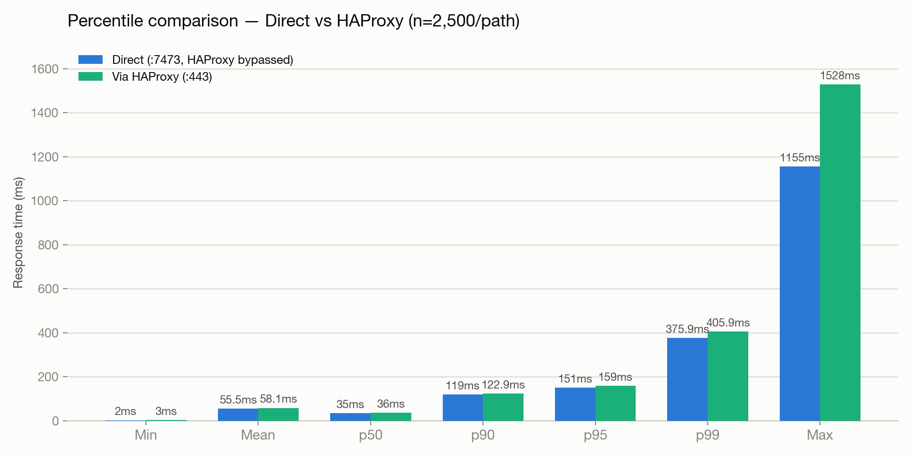
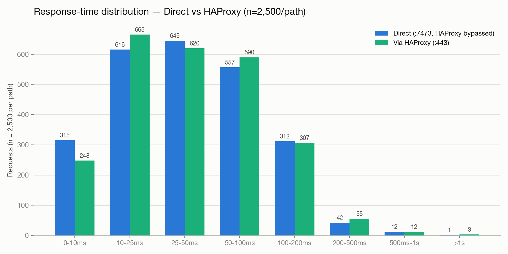

# Validated Run — 2026-07-14

Renders directly on GitHub (no download needed) — the source data is the same run as the interactive dashboard at [`sample-report/index.html`](sample-report/index.html), which has the response-time-over-time graphs if you want those instead.

This run adds a **warm-up phase** (1,000 untracked requests — 500 per path — via the test plan's `00 - Warm-up` Setup Thread Group) before the measured run, so JIT compilation, connection establishment, and page cache are past cold-start before anything is recorded. It also uses a **larger sample** than the first pass at this concurrency — 2,500 measured requests per path (5,000 total) instead of 500 — for a statistically sturdier read, especially on the tail percentiles. Two earlier, smaller runs are superseded by this one: a [cold-start run](https://github.com/neo4j-field/neo4j-aws-privatelink-443/blob/f772c37/performance-testing/results/2026-07-13-validated-run.md) and a [warmed-up but smaller run](https://github.com/neo4j-field/neo4j-aws-privatelink-443/blob/51f46e3/performance-testing/results/2026-07-14-validated-run.md) at 500/path.

## Setup

| | |
|---|---|
| Target | Single-instance deployment (`approach-3-lts-single-instance`), private IP `10.0.153.25` |
| Query | `MATCH (p:PerfTestPerson {id: $id}) RETURN p.id, p.name, p.email, p.city` — indexed point lookup, `id` randomized 1–10000 per request (see [`../queries.md`](../queries.md)) |
| Dataset | 10,000 `:PerfTestPerson` nodes seeded via [`../seed-data.cypher`](../seed-data.cypher) |
| Warm-up | 10 threads × 50 loops = 500 untracked requests per path, immediately before the measured run |
| Load profile | 25 threads, 10s ramp-up, 100 loops/thread = **2,500 measured requests per path** (5,000 total measured; 6,000 total requests issued) |
| Tool | JMeter 5.6.3, [`../jmeter/HAProxy-vs-Direct-Neo4j.jmx`](../jmeter/HAProxy-vs-Direct-Neo4j.jmx), run via `-JWARMUP_THREADS=10 -JWARMUP_LOOPS=50 -JTHREADS=25 -JRAMPUP=10 -JLOOPS=100` |

**Methodology note:** the JMeter client and Neo4j+HAProxy run on the *same* EC2 instance for this validated example (see [Test topology](../README.md#test-topology) for why: it isolates HAProxy's cost from PrivateLink/cross-VPC network cost). At 25 concurrent threads, the JMeter client itself now competes for CPU with the server under test — that's almost certainly why absolute latency rose across the board vs. the 10-thread run (mean ~16-22ms → ~55-58ms). This doesn't invalidate the Direct-vs-HAProxy *comparison* (both paths share the same confound equally), but it does mean the absolute numbers here are conservative for a real deployment where the test client and Neo4j aren't on the same box. Running the client from a separate host in the same VPC would remove this effect.

## Results

| Metric | Direct (`:7473`, HAProxy bypassed) | Via HAProxy (`:443`) | Delta |
|---|---:|---:|---:|
| Samples | 2,500 | 2,500 | 0 |
| Errors | 0 (0%) | 0 (0%) | 0 |
| Mean (ms) | 55.5 | 58.1 | +2.7 |
| Median (ms) | 35.0 | 36.0 | +1.0 |
| p90 (ms) | 119.0 | 122.9 | +3.9 |
| p95 (ms) | 151.0 | 159.0 | +8.0 |
| p99 (ms) | 375.9 | 405.9 | **+30.0** |
| Min (ms) | 2 | 3 | +1 |
| Max (ms) | 1155 | 1528 | +373 |
| Throughput (req/s) | 158.0 | 158.4 | +0.4 |
| Received (KB/s) | 47.8 | 47.9 | +0.1 |
| Sent (KB/s) | 61.1 | 60.5 | −0.6 |

## Response-time distribution

| Bucket | Direct — count (%) | Via HAProxy — count (%) |
|---|---:|---:|
| 0–10ms | 315 (12.6%) | 248 (9.9%) |
| 10–25ms | 616 (24.6%) | 665 (26.6%) |
| 25–50ms | 645 (25.8%) | 620 (24.8%) |
| 50–100ms | 557 (22.3%) | 590 (23.6%) |
| 100–200ms | 312 (12.5%) | 307 (12.3%) |
| 200–500ms | 42 (1.7%) | 55 (2.2%) |
| 500–1000ms | 12 (0.5%) | 12 (0.5%) |
| >1000ms | 1 (0.0%) | 3 (0.1%) |

## Reading this run

At 5x the sample size, the signal is cleaner than either smaller run: **HAProxy is now slower at every single percentile**, not just some — a small, consistent, monotonically-growing cost rather than the noisy either-direction deltas seen at n=500. The gap is modest through the middle of the distribution (+1–8ms through p95) and widens at the tail (+30ms at p99, +373ms at max). Throughput is essentially identical (158.0 vs 158.4 req/s) — HAProxy isn't limiting overall capacity here, it's adding a small, mostly-tail-concentrated latency cost.

This is a materially more trustworthy result than the two smaller runs before it: n=2,500 gives ~25 samples in the "worst 1%" bucket instead of ~5, so the p99 number is no longer 2-3 outlier requests away from swinging in either direction.

## Verdict

> Across 2,500 samples per path at 25 concurrent threads (same-host client, so absolute numbers are conservative — see methodology note above), HAProxy's TLS-bridging hop added a small, consistent cost at every percentile: +1-8ms through p95, growing to +30ms at p99 and +373ms at max. Throughput was unaffected (158 req/s either way). For most application use cases where p95 is the operative SLA, this overhead is very likely negligible; if the customer's SLA is pinned to p99 or worse, the ~30ms (~8%) tail cost is real and worth factoring in, though still modest in absolute terms.
